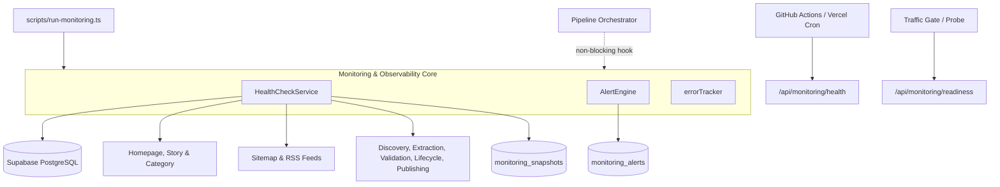
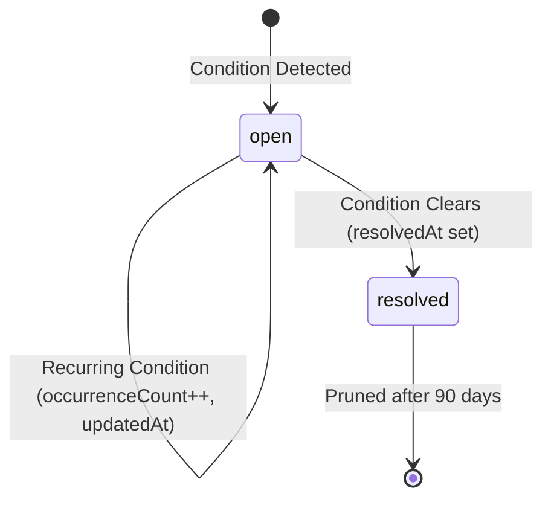

# The Meridian — Production Monitoring, Reliability & Observability Engine

## 1. System Architecture Overview

The Meridian Production Monitoring, Reliability & Observability Engine provides unified, real-time telemetry across the entire end-to-end news platform. It tracks availability, stage latencies, queue depths, pipeline lag, scheduler freshness, and system integrity while adhering to two non-negotiable architectural invariants:

1. **Non-Fatal Observability**: Monitoring runs out-of-band or in non-blocking try/catch contexts. Any failure in health probes or database logging will **never** interrupt or crash the news processing pipeline.
2. **Zero Editorial UI / No CMS (Phase 13 Skipped)**: Pure infrastructure, telemetry endpoints, alerting rules, and CLI tooling. No administrative dashboards or content management interfaces are introduced.
3. **Strict Zero-Leakage Security**: Endpoints and tables are strictly shielded behind server authentication and PostgreSQL Row Level Security (RLS). Public anonymous clients receive zero access.

---

## 2. Universal Health Model

Every monitored component reports a structured `ServiceHealth` record:

| Status | Definition | Platform Impact |
|---|---|---|
| `healthy` | Service is operating normally within latency thresholds. | Full operational state. |
| `degraded` | Service has elevated latency or non-critical issue (e.g. single source failing). | System remains functional; alerts raised for review. |
| `failed` | Service is unreachable, throwing hard errors, or critically stale. | Triggers critical alert; if DB or site is down, overall status is `failed`. |
| `disabled` | Service intentionally deactivated (e.g. publication kill switch). | Normal behavior; does **not** degrade overall system status. |
| `unknown` | Status could not be determined due to missing configuration. | Investigated on next probe. |

### Overall System Status Evaluation

- **`failed`**: Supabase database unreachable OR public website unreachable.
- **`degraded`**: Any non-disabled service is `failed` (e.g. discovery stage failing) or `degraded` (e.g. elevated queues).
- **`healthy`**: All critical and core platform services report `healthy`.

---

## 3. Observability Endpoints

### `GET /api/monitoring/health`
Returns full platform diagnostic health, queue depths, latencies, and active alerts.
- **Authentication**: Requires `x-monitoring-secret`, `x-cron-secret`, or `Authorization: Bearer <secret>`.
- **Query Parameters**:
  - `persist=true|false`: Whether to record a snapshot row in `monitoring_snapshots` (default: `true`).
  - `dryRun=true|false`: Evaluate health and alerts without mutating database records.
  - `prune=true|false`: Prune expired snapshots and resolved alerts past retention windows.
- **HTTP Status Codes**:
  - `200 OK`: System status is `healthy` or `degraded`.
  - `503 Service Unavailable`: System status is `failed` (critical infrastructure down).
  - `401 Unauthorized`: Missing or invalid secret.
- **Header**: Includes `x-request-id` correlation identifier.

### `GET /api/monitoring/readiness`
Ultra-fast ingress gate and deployment readiness probe.
- **Authentication**: Requires authorized monitoring credentials.
- **Checks**: Verifies database connection and storage table access.
- **HTTP Status Codes**:
  - `200 OK`: Platform ready to serve news and accept traffic (`ready: true`).
  - `503 Service Unavailable`: Database or storage unreachable (`ready: false`).

---

## 4. Alert Lifecycle & Deduplication

Alerts in `monitoring_alerts` transition through a managed lifecycle:

1. **Detection**: `AlertEngine.evaluateConditions()` checks metrics against configured thresholds.
2. **Deduplication**: If an active alert with matching `(code, service)` exists, `occurrenceCount` is incremented and `lastDetectedAt` is updated. No duplicate rows are created.
3. **Auto-Resolution**: When a subsequent check indicates the condition has cleared, the alert is automatically updated to `status = 'resolved'` with the `resolvedAt` timestamp.
4. **Notification-Ready Payloads**: Whenever a new alert opens, `notificationReady` structured payloads are generated for downstream notification dispatchers (e.g. future webhooks).

---

## 5. Thresholds Reference Table

| Metric / Stage | Warning Threshold | Critical Threshold | Configuration Key |
|---|---|---|---|
| **Scheduler Staleness** | 20 minutes delay | 60 minutes delay | `MONITORING_CONFIG.scheduler` |
| **Extraction Queue Depth** | 100 pending candidates | 500 pending candidates | `queues.extractionMaxPendingWarn` |
| **Validation Queue Depth** | 50 pending extractions | 200 pending extractions | `queues.validationMaxPendingWarn` |
| **Oldest Queue Item Age** | 3,600s (1 hour) | 7,200s (2 hours) | `queues.oldestItemAgeCriticalSec` |
| **Source Failures** | 3 consecutive failures | All sources failing | `sources.consecutiveFailuresWarn` |
| **Publication Rate Anomaly** | - | > 20 stories published / hr | `publishing.maxPerHourAnomalyThreshold` |
| **Database Ping Latency** | 1,500 ms | 5,000 ms | `database.pingLatencyWarnMs` |
| **Snapshot Retention** | - | 30 days | `retention.snapshotsDays` |
| **Resolved Alert Retention** | - | 90 days | `retention.resolvedAlertsDays` |

---

## 6. Security, RLS & Safe Error Sanitization

1. **Row Level Security (RLS)**:
   - `monitoring_alerts` and `monitoring_snapshots` have RLS enabled.
   - Public anonymous requests (`anon` key) are strictly denied (`USING (false)`).
   - Only backend server services using `service_role` can insert, update, or read.
2. **Error Tracker & Sanitizer**:
   - `errorTracker.ts` ensures no JWT tokens, database connection passwords, or NVIDIA keys (`nvapi-*`) appear in user-facing responses or error messages.
   - Stack traces are omitted in client responses and retained only in server logs.
3. **Client React ErrorBoundary**:
   - `src/components/common/ErrorBoundary.tsx` catches runtime React rendering crashes.
   - Renders a dignified editorial recovery message with a unique Reference ID (`req_*`), allowing users to return to the front page without exposing stack traces.
